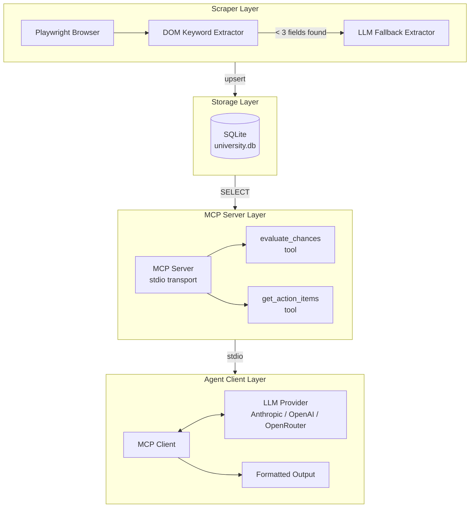
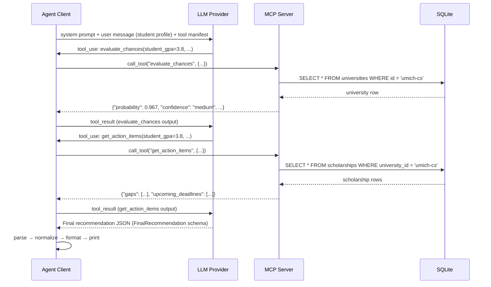
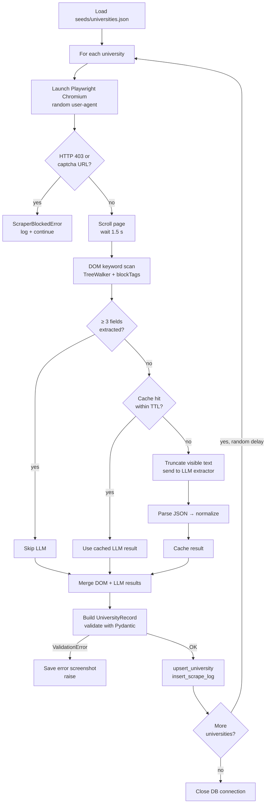

# University Admission MCP

An end-to-end agentic system that scrapes university admissions pages, normalizes the data into SQLite, serves it through an [MCP](https://modelcontextprotocol.io) server, and lets an LLM call tools to generate a personalized admissions recommendation.

---

## Table of contents

- [What it does](#what-it-does)
- [Architecture](#architecture)
- [Project layout](#project-layout)
- [Data model](#data-model)
- [Scoring model](#scoring-model)
- [Prerequisites](#prerequisites)
- [Setup](#setup)
- [Configuration](#configuration)
- [Running the system](#running-the-system)
- [Example output](#example-output)
- [MCP tool reference](#mcp-tool-reference)
- [MCP sequence diagram](#mcp-sequence-diagram)
- [Scraper internals](#scraper-internals)
- [Testing](#testing)
- [Scaling to 10,000 universities](#scaling-to-10000-universities)
- [Troubleshooting](#troubleshooting)

---

## What it does

| Step       | What happens                                                                                                                                                                                      |
| ---------- | ------------------------------------------------------------------------------------------------------------------------------------------------------------------------------------------------- |
| **Scrape** | Playwright navigates each university admissions page; a DOM keyword extractor pulls numeric fields directly. If fewer than 3 fields are found the page text is sent to an LLM fallback extractor. |
| **Store**  | Normalized `UniversityRecord` and `ScholarshipRecord` objects are upserted into SQLite. A `scrape_log` table tracks run status and null fields.                                                   |
| **Serve**  | An MCP server exposes two tools — `evaluate_chances` and `get_action_items` — over stdio.                                                                                                         |
| **Advise** | An agentic client launches the server as a subprocess, feeds the student profile to the LLM, and drives the tool-calling loop until a final JSON recommendation is returned.                      |
| **Print**  | The recommendation is parsed, normalized, and formatted as a readable summary.                                                                                                                    |

---

## Architecture



The system is split into three independent layers joined by well-defined interfaces. The scraper writes typed records; the MCP server reads them through a `Database` abstraction; the client never touches SQL directly and is decoupled from the provider SDK by a thin `OpenAICompatibleClient` wrapper.

---

## Project layout

```
mcp-college-counselor/
├── config.py               # Pydantic Settings – env vars, path helpers
├── errors.py               # AppError hierarchy (ToolError, ScraperBlockedError, …)
├── llm_provider.py         # OpenAI-compatible HTTP client (OpenRouter / OpenAI / Anthropic)
├── Makefile                # install / scrape / serve / run / test / typecheck
├── requirements.txt
│
├── client/
│   └── client.py           # Agentic loop, tool-result parsing, pretty printer
│
├── db/
│   └── schema.sql          # DDL for universities, scholarships, scrape_log
│
├── mcp_server/
│   ├── db.py               # Async SQLite wrapper (aiosqlite)
│   ├── server.py           # MCP server – list_tools + call_tool handlers
│   └── tools/
│       ├── evaluate_chances.py   # Weighted scoring → probability + confidence
│       └── get_action_items.py   # Gap analysis + upcoming scholarship deadlines
│
├── scraper/
│   ├── models.py           # UniversityRecord / ScholarshipRecord (Pydantic)
│   ├── scraper.py          # UniversityScraper – retry, anti-bot, DB write
│   └── selectors.py        # SelfHealingExtractor (DOM → LLM fallback)
│
├── seeds/
│   └── universities.json   # Seed list: id, name, URL
│
├── data/                   # Created at runtime – holds university.db
└── tests/
    ├── conftest.py
    ├── test_client_integration.py
    ├── test_config.py
    ├── test_evaluate_chances.py
    ├── test_get_action_items.py
    └── test_scraper.py
```

---

## Data model

```
┌─────────────────────────────────────────────────┐
│                  universities                   │
├──────────────────┬──────────────────────────────┤
│ id               │ TEXT  PRIMARY KEY             │
│ name             │ TEXT  NOT NULL                │
│ url              │ TEXT                          │
│ program_level    │ TEXT  phd/masters/undergrad   │
│ acceptance_rate  │ REAL  [0, 1]                  │
│ min_gpa          │ REAL  [0, 4.0]                │
│ min_gre_verbal   │ INT   [130, 170]              │
│ min_gre_quant    │ INT   [130, 170]              │
│ requires_sat     │ INT   0 / 1                   │
│ min_sat          │ INT   [400, 1600]             │
│ ap_classes_req   │ INT                           │
│ lor_count        │ INT                           │
│ scraped_at       │ TEXT  (ISO-8601)              │
└──────────────────┴──────────────────────────────┘
          │ 1
          │ has many
          ▼ N
┌─────────────────────────────────────────────────┐
│                  scholarships                   │
├──────────────────┬──────────────────────────────┤
│ id               │ INT   AUTOINCREMENT PK        │
│ university_id    │ TEXT  FK → universities(id)   │
│ name             │ TEXT  NOT NULL                │
│ deadline         │ TEXT  (ISO-8601 date)         │
│ amount_usd       │ INT                           │
└──────────────────┴──────────────────────────────┘

┌─────────────────────────────────────────────────┐
│                   scrape_log                    │
├──────────────────┬──────────────────────────────┤
│ id               │ INT   AUTOINCREMENT PK        │
│ university_id    │ TEXT                          │
│ run_at           │ TEXT  (ISO-8601)              │
│ status           │ TEXT  success/partial/failed  │
│ null_fields      │ TEXT  JSON array              │
└──────────────────┴──────────────────────────────┘
```

---

## Scoring model

`evaluate_chances` computes a weighted admission probability from four components:

$$P = 0.40 \cdot S_{\text{GPA}} + 0.30 \cdot S_{\text{test}} + 0.20 \cdot S_{\text{AP}} + 0.10 \cdot S_{\text{LoR}}$$

Each component score $S$ is clamped to $[0, 1]$ and computed as:

| Component      | Weight | Formula                                                                                  |
| -------------- | ------ | ---------------------------------------------------------------------------------------- |
| GPA            | 40%    | $\min\!\left(1,\; \dfrac{\text{student\_gpa}}{\text{min\_gpa}}\right)$                   |
| Test score     | 30%    | SAT ratio if required; average GRE verbal+quant ratio otherwise; 1.0 if no test required |
| AP classes     | 20%    | $\min\!\left(1,\; \dfrac{\text{ap\_completed}}{\text{ap\_required}}\right)$              |
| Letters of rec | 10%    | $\min\!\left(1,\; \dfrac{\text{lor\_count}}{\text{lor\_required}}\right)$                |

**Confidence** reflects how many of the scored fields had data in the database:

| Null fields | Confidence |
| ----------- | ---------- |
| 0           | `high`     |
| 1–2         | `medium`   |
| 3+          | `low`      |

**Probability labels** used in the printed output:

| Range  | Label  |
| ------ | ------ |
| < 40%  | Low    |
| 40–65% | Medium |
| > 65%  | High   |

---

## Prerequisites

- Python 3.10+
- `make` (optional, for Makefile shortcuts)
- Chromium via Playwright
- On Ubuntu / WSL: `libgbm1` and `libasound2`

```bash
sudo apt-get update && sudo apt-get install -y libgbm1 libasound2
```

---

## Setup

**Option A – Makefile**

```bash
make install
cp .env.example .env
# fill in your API key in .env
```

**Option B – manual**

```bash
python3 -m venv .venv
source .venv/bin/activate
pip install -r requirements.txt
python3 -m playwright install chromium
cp .env.example .env
```

---

## Configuration

Copy `.env.example` to `.env` and fill in the key for your chosen provider. All other variables have working defaults.

### OpenRouter (recommended – free tier available)

```env
MODEL_PROVIDER=openrouter
OPENROUTER_API_KEY=sk-or-...
OPENROUTER_BASE_URL=https://openrouter.ai/api/v1
LLM_EXTRACTION_MODEL=openai/gpt-oss-20b:free
CLIENT_MODEL=openai/gpt-oss-20b:free
```

### OpenAI / OpenAI-compatible endpoint

```env
MODEL_PROVIDER=openai
OPENAI_API_KEY=sk-...
OPENAI_BASE_URL=https://api.openai.com/v1   # or any OpenAI-compatible base URL
LLM_EXTRACTION_MODEL=gpt-4o-mini
CLIENT_MODEL=gpt-4o
```

### Anthropic

```env
MODEL_PROVIDER=anthropic
ANTHROPIC_API_KEY=sk-ant-...
LLM_EXTRACTION_MODEL=claude-haiku-4-5
CLIENT_MODEL=claude-sonnet-4-5
```

### Full environment variable reference

| Variable               | Required        | Default                              | Description                                                          |
| ---------------------- | --------------- | ------------------------------------ | -------------------------------------------------------------------- |
| `DATABASE_URL`         | Yes             | `sqlite+aio:///./data/university.db` | SQLite DSN used by scraper and server                                |
| `MODEL_PROVIDER`       | Yes             | `anthropic`                          | `anthropic`, `openai`, or `openrouter`                               |
| `ANTHROPIC_API_KEY`    | If `anthropic`  | —                                    | Anthropic API key                                                    |
| `OPENAI_API_KEY`       | If `openai`     | —                                    | OpenAI-compatible API key                                            |
| `OPENAI_BASE_URL`      | If `openai`     | `https://api.openai.com/v1`          | Base URL for OpenAI-compatible requests                              |
| `OPENROUTER_API_KEY`   | If `openrouter` | —                                    | OpenRouter API key                                                   |
| `OPENROUTER_BASE_URL`  | If `openrouter` | `https://openrouter.ai/api/v1`       | OpenRouter base URL                                                  |
| `LLM_EXTRACTION_MODEL` | Yes             | `claude-haiku-4-5`                   | Model used by the scraper fallback extractor                         |
| `CLIENT_MODEL`         | Yes             | `claude-sonnet-4-5`                  | Model used by the agentic client                                     |
| `SCRAPE_DELAY_MIN`     | Yes             | `3.0`                                | Min randomized delay between page scrapes (seconds)                  |
| `SCRAPE_DELAY_MAX`     | Yes             | `9.0`                                | Max randomized delay between page scrapes (seconds)                  |
| `EXTRACTION_CACHE_TTL` | Yes             | `86400`                              | In-process cache lifetime for LLM extraction results (seconds)       |
| `LOG_LEVEL`            | Yes             | `INFO`                               | Structlog verbosity: `DEBUG`, `INFO`, `WARNING`, `ERROR`, `CRITICAL` |

---

## Running the system

### Step 1 — Scrape university data

Navigates each URL in `seeds/universities.json`, extracts admission requirements, and writes records to `data/university.db`.

```bash
python3 -m scraper.scraper
# or
make scrape
```

Scraper log output (structured JSON via structlog):

```json
{"event": "scrape_success", "university_id": "mit-eecs", "confidence": "high", "null_fields": [], "level": "info"}
{"event": "scrape_success", "university_id": "stanford-cs", "confidence": "medium", "null_fields": ["min_gre_verbal"], "level": "info"}
{"event": "scrape_blocked", "university_id": "cmu-scs", "error": "Received HTTP 403 while scraping", "level": "warning"}
```

### Step 2 — (Optional) Run the MCP server standalone

Useful for inspecting or debugging the tool layer independently.

```bash
python3 -m mcp_server.server
# or
make serve
```

The server speaks MCP over stdio and exposes two tools: `evaluate_chances` and `get_action_items`.

### Step 3 — Run the full agentic client

Launches the MCP server as a subprocess, drives the LLM tool-calling loop, and prints the recommendation.

```bash
python3 -m client.client
# or
make run
```

---

## Example output

The client always produces the same structured block regardless of which provider is used. The exact wording of the strategic recommendation varies by model.

```
University Admission Recommendation
=================================
Student: Alex Rivera
Target university: University of Michigan - CS
Admission probability: High (96.7%)
Tool calls: 3
Total latency: 19.3s

Top gaps
- AP classes: your 4 is 1.00 below University of Michigan - CS minimum of 5.
- Letters of recommendation: your 2 is 1.00 below University of Michigan - CS minimum of 3.

Upcoming deadlines
- None

Recommendation
Alex has a strong academic profile. Priority actions: complete one additional AP-level
course before application; secure a third letter of recommendation from a STEM faculty
member who can speak directly to research ability.
```

The student profile driving this run (defined in `client/client.py`):

```python
STUDENT_PROFILE = {
    "name": "Alex Rivera",
    "gpa": 3.8,
    "sat_score": 1600,
    "gre_verbal": 155,
    "gre_quant": 165,
    "ap_classes_completed": 4,
    "lor_count": 2,
    "target_university_id": "umich-cs",
}
```

The `FinalRecommendation` schema returned by the tool loop:

```json
{
  "student_name": "Alex Rivera",
  "target_university": "University of Michigan - CS",
  "admission_probability": 0.967,
  "probability_label": "High",
  "top_gaps": [
    "AP classes: your 4 is 1.00 below University of Michigan - CS minimum of 5.",
    "Letters of recommendation: your 2 is 1.00 below University of Michigan - CS minimum of 3."
  ],
  "upcoming_deadlines": [],
  "strategic_recommendation": "Alex has a strong academic profile...",
  "tool_calls_made": 3,
  "total_latency_ms": 19300
}
```

---

## MCP tool reference

Both tools share the same input schema:

```
┌──────────────────────────┬──────────────────┬──────────────────────────────────────┐
│ Field                    │ Type             │ Description                          │
├──────────────────────────┼──────────────────┼──────────────────────────────────────┤
│ student_gpa              │ float [0, 4.0]   │ Student's GPA (required)             │
│ ap_classes_completed     │ int ≥ 0          │ Number of AP classes taken (required)│
│ lor_count                │ int ≥ 0          │ Letters of recommendation (required) │
│ target_university_id     │ string           │ University slug, e.g. "mit-eecs"     │
│ sat_score                │ int [400, 1600]  │ Optional                             │
│ gre_verbal               │ int [130, 170]   │ Optional                             │
│ gre_quant                │ int [130, 170]   │ Optional                             │
└──────────────────────────┴──────────────────┴──────────────────────────────────────┘
```

### `evaluate_chances` → `EvaluateChancesOutput`

```json
{
  "probability": 0.875,
  "component_scores": {
    "gpa": 1.0,
    "test": 1.0,
    "ap_classes": 1.0,
    "lor": 1.0
  },
  "university_name": "University of Michigan - CS",
  "confidence": "medium"
}
```

### `get_action_items` → `GetActionItemsOutput`

```json
{
  "gaps": [
    "GPA: your 3.2 is 0.30 points below University of Michigan - CS minimum of 3.5."
  ],
  "upcoming_deadlines": [
    {
      "name": "UMich CS Fellowship",
      "deadline": "2026-12-01",
      "days_remaining": 218
    }
  ],
  "is_competitive": false,
  "university_name": "University of Michigan - CS"
}
```

Deadlines are filtered to scholarships due within the next 90 days and sorted ascending by date.

---

## MCP sequence diagram



---

## Scraper internals



The keyword map used by the DOM extractor:

| Field             | Trigger keywords                                  |
| ----------------- | ------------------------------------------------- |
| `acceptance_rate` | acceptance rate, admit rate, admissions rate      |
| `min_gpa`         | minimum gpa, gpa requirement, grade point average |
| `min_gre_verbal`  | gre verbal, verbal reasoning                      |
| `min_gre_quant`   | gre quantitative, quant reasoning                 |
| `min_sat`         | sat score, minimum sat                            |
| `ap_classes_req`  | ap class, advanced placement                      |
| `lor_count`       | letters of recommendation, recommendation letter  |
| `scholarship`     | scholarship, fellowship, funding, financial aid   |

---

## Testing

Run the full test suite (39 tests):

```bash
python3 -m pytest tests/ -v --asyncio-mode=auto
# or
make test
```

Run focused subsets:

```bash
# Integration + config only
python3 -m pytest tests/test_client_integration.py tests/test_config.py -v --asyncio-mode=auto

# Scoring logic only
python3 -m pytest tests/test_evaluate_chances.py tests/test_get_action_items.py -v --asyncio-mode=auto
```

Strict type-checking:

```bash
python3 -m mypy . --strict --ignore-missing-imports
# or
make typecheck
```

Lint:

```bash
python3 -m ruff check .
# or
make lint
```

Test file overview:

| File                         | What it covers                                                       |
| ---------------------------- | -------------------------------------------------------------------- |
| `test_config.py`             | Settings validation, provider selector, path helpers                 |
| `test_evaluate_chances.py`   | Weighted scoring, confidence bands, null-field handling              |
| `test_get_action_items.py`   | Gap detection, deadline filtering, competitive flag                  |
| `test_client_integration.py` | Tool-result parsing, recommendation normalization, output formatting |
| `test_scraper.py`            | DOM extraction, LLM fallback, retry behavior, DB writes              |

---

## Scaling to 10,000 universities

### Crawl orchestration

Replace the single-process loop with a queue-driven worker fleet. Seed URLs become crawl jobs with priority, freshness SLA, and retry metadata. Workers shard by university or domain to preserve per-site pacing and isolate failures. Dynamic pages keep Playwright; static pages can be downgraded to plain HTTP + parser workers after a capability probe.

### Freshness strategy

Don't scrape every school on the same cadence. Admission requirements change slowly; deadlines change seasonally. Track field-level freshness and trigger refreshes from three signals: TTL expiry, structural page diffs, and downstream tool demand. A cheap checksum on visible page text skips expensive extraction when content hasn't materially changed.

### Cost controls

Keep the LLM fallback rare. The DOM semantic pass handles the majority of fields; the in-process cache deduplicates repeated extraction for the same content hash. Pool browsers across jobs, use domain-aware concurrency ceilings, and store screenshots and raw text only for partial or failed scrapes.

### Quality and serving

Treat extraction quality as a measurable pipeline. Persist scrape status, null fields, and parser confidence so MCP tools can surface uncertainty rather than hide it. Maintain regression fixtures using recorded HTML snapshots from representative university pages. On the serving side, keep SQLite for local development and migrate to Postgres with read replicas once multi-client MCP traffic or write volume outgrows a single-file database.

---

## Troubleshooting

**Chromium fails to launch on Linux / WSL**

```bash
sudo apt-get install -y libgbm1 libasound2
```

**App ignores `.env` settings**

Stale shell exports (`MODEL_PROVIDER`, `OPENAI_BASE_URL`, `CLIENT_MODEL`, `LLM_EXTRACTION_MODEL`) override `.env`. Unset them or open a fresh terminal:

```bash
unset MODEL_PROVIDER OPENAI_BASE_URL CLIENT_MODEL LLM_EXTRACTION_MODEL
```

**Scraper returns low-confidence records with many null fields**

The target page may be sparse, behind a login, or structured in a way the DOM extractor doesn't recognize. The pipeline still completes end-to-end, but the recommendation will be less specific. Check `/tmp/screenshots/` for any parse-error screenshots saved during the run.

**LLM returns a non-JSON final response**

The client's `parse_final_recommendation` function falls back gracefully: it builds a default payload from the raw tool results captured during the conversation, so a complete recommendation is always printed even if the model's final turn isn't valid JSON.
